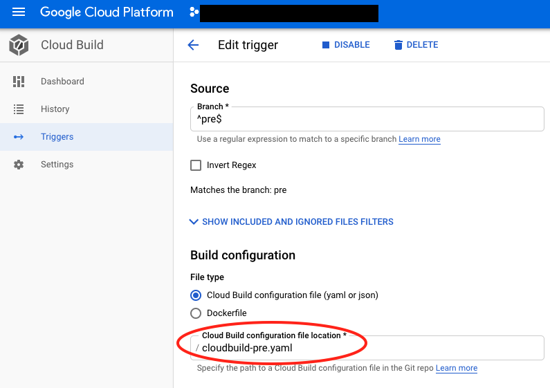

# Nombre de la técnica
Buenas prácticas de seguridad utilizando CloudBuild-GAE-KMS.

## Descripción
Recomendación de seguridad cuando queremos utilizar usuario y contraseña dentro de un servicio GAE en entornos GCP. El objetivo es saber utilizar KMS dentro del pipeline en CloudBuild y así utilizar contraseñas encriptadas dentro del servicio de GAE.

#### v0.1
Versión beta

#### Autores
* [Cesar Enrique Gonzales Yaipen](mailto:cesarenrique.gonzales.next@bbva.com)

#### GCP 25-05-2020
Tribu GCP 25-05-2020

#### Seguridad, GCP, GAE, KMS, CloudBuild

## Introducción
Esta recomendación aplica usando solo servicios GCP, en caso tengas un repositorio de contraseñas On-premise/Otras cloud públicas, esta recomendación puede aplicar pero ya depende de los requisitos del proyecto, ya que tener varios repositorios de contraseñas no es una buena opción.

## Objetivo
Brindar una guía de cómo utilizar CloudBuild-GAE-KMS en entornos GCP cumpliendo las buenas prácticas de seguridad. Eso no quiere decir que esta es la única opción válida, solo una de las tantas opciones posibles.

## Solución
### Requisitos
Es necesario cumplir con los siguientes requerimientos:
* Habilitar las APIs de KMS, GAE, CloudBuild en GCP.
* Agregar al usuario de servicio de CloudBuild el role Cloud KMS CryptoKey Decrypter (necesario para desencriptar la clave KMS).
* El usuario que lance los comandos que se indican en los siguientes puntos necesitan permisos Admin en KMS, GAE y CloudBuild como mínimo. 

### Cloud Key Management Service (KMS)
Es un servicio de gestión de claves de GCP que te permite administrar las claves encriptadas. A través de él puedes generar, usar, rotar y eliminar claves criptográficas AES256, RSA 2048, RSA 3072, RSA 4096, EC P256 y EC P384. 
Para poder generar claves simétricas/asimétricas es necesario tener creado o crear un Key Ring, para ello seguir estos pasos:
```
# If we do not have a keyring
gcloud kms keyrings create next-integration-secrets --location global

# If we already had a keyring or just created one, take a look at what keys are on it
gcloud kms keys list --location global --keyring next-integration-secrets
```

En nuestro ejemplo usaremos una clave simétrica (diferencias entre clave simétrica/asimétrica, click [aquí](https://cloud.google.com/kms/docs/algorithms)), en donde almacenaremos la contraseña a encriptar.
```
# To add a simetric key - one per application
gcloud kms keys create next-js-node-back --location global --keyring next-integration-secrets --purpose encryption

# Verify that your keyring has the keys you expect
gcloud kms keys list --location global --keyring next-integration-secrets

# Create a local file with the secret
echo "MyPassword1234" > redis_pw.txt

# To encrypt a secret using KMS
gcloud kms encrypt \
  --plaintext-file=next_test_pw.txt \
  --ciphertext-file=next_test_pw.enc.txt \
  --location=global \
  --keyring=next-integration-secrets \
  --key=next-js-node-back
  
# Encode the binary encoded secret as base64 string
base64 next_test_pw.enc.txt -w 0 > next_test_pw.enc.64.txt
```
**Nota:** En entornos productivos se recomienda habilitar rotación de claves, para mas información hacer click [aquí](https://cloud.google.com/kms/docs/rotating-keys)
### App Engine (GAE)
Crea y despliega aplicaciones en una plataforma totalmente gestionada, puedes elegir distintos lenguajes como Java, Node.js, Python entre otros, además te da opción a elegir el módulo Standard o Flexible. En este caso usaremos el módulo Standard y como lenguaje de la aplicación Node.js

Supongamos que dentro del código tenemos distintas variables de entorno definidos. siendo una de ellas la contraseña del usuario de conexión con el backend (CloudSQL), llamada NEXT_BACK_MYSQLUSER.

```
// Infere Front URL
const env = process.env.ENVIRONMENT;
let cnf = {
    store: {
        options: {
            password: process.env.NEXT_BACK_MYSQLPASSWORD
                 }
           }
       };
export const config = cnf           
```

**Nota:** Otra posible solución es que dentro del código de la aplicación, esta tenga permisos en KMS para desencriptar la contraseña y sea esta la encargada de toda esta operación, pero en este caso nos basaremos en que el CI de la aplicación tomará esa función, quitando esa responsabilidad al desarrollador.

### Desencriptando la contraseña utilizando CloudBuild
CloudBuild nos permite CI/CD de cualquier aplicación dentro de la infraestructura de GCP, definiendo una serie de steps basados en dockers, lo que nos otorga la flexibilidad necesaria para desencriptar la contraseña creada en uno de los puntos anteriores.

Un tema importante es el fichero de configuración (en json o yaml) el cual contiene las intrucciones que utilizará CloudBuild para el despliegue de la aplicación, por defecto busca cloudbuild.yaml, pero puedes personalizarlo y llamarlo cloudbuild-custom.yaml si es necesario, esto es necesario en nuestro caso ya que cada entorno (DEV, QA, PRE y PRO) debería tener una contraseña distinta. Para definirlo necesitamos configurar el trigger dentro de CloudBuild, como se puede ver en la siguiente imagen:



El trigger es el encargado de detectar cambios (pushes) en el repositorio que hemos configurado previamente en Cloud Source Repositories.

A continuación veremos un cloudbuid-pre.yaml que usaremos en este caso, donde:
* Definimos un **secretEnv** (al final del fichero) que contiene la contraseña encriptada, en este apartado indicamos la clave KMS que hemos definido anteriormente (projects/next-integration/locations/global/keyRings/next-integration-secrets/cryptoKeys/next-js-node-back) y el nombre (BACK_MYSQLPASSWORD) para referirnos a ella.
* En vez de dejar que GAE genere automáticamente el docker a desplegar, lo personalizaremos para pasarle el valor de la contraseña desencriptada con el parámetro **--build-arg** cuando hacemos el build. Es muy importante que el usuario de servicio de CloudBuild tenga permisos para desencriptar claves KMS (si hay dudas revisar los requisitos).
* Pusheamos el docker generado en Container Registry.
* Desplegamos el docker dentro del servicio GAE definido.
```
steps:  
# Building image
# Note: You need a shell to resolve environment variables with $$
- name: 'gcr.io/cloud-builders/docker'
  entrypoint: 'bash'
  args: [ 
          '-c',
          'docker build -t gcr.io/$PROJECT_ID/appengine/ts-cloudbuild-secrets-example:latest -f Dockerfile --build-arg BACK_MYSQLPASSWORD=$$MYSQLPASSWORD .' 
        ]
  secretEnv: ['MYSQLPASSWORD']     
# Push Images       
- name: 'gcr.io/cloud-builders/docker'
  args: ['push', 'gcr.io/$PROJECT_ID/appengine/ts-cloudbuild-secrets-example:latest'] 
  
# Deploy to GAE
- name: 'gcr.io/cloud-builders/gcloud'
  args: 
  - 'app'
  - 'deploy'
  - 'app.yaml'
  - '--image-url'
  - 'gcr.io/$PROJECT_ID/appengine/ts-cloudbuild-secrets-example:latest'
secrets:
- kmsKeyName: projects/next-integration/locations/global/keyRings/next-integration-secrets/cryptoKeys/next-js-node-back
  secretEnv:
    MYSQLPASSWORD: CiQAkmpYKP7L1ELHIrdBG/J66k1w6EN/l4wgVZnBMMhbEr/dFxYSPQBMN3wJgwxNRTNmNpaif4rSOSHKy7gHTamaxsxo3la2qCLJfVSHz8jUA4jERssiMZAeKhHvfp5LBTDvjxk=
```
Como vamos a hacer el build del docker necesitamos definir el fichero Dockerfile, y tener declarado el argumento que contendrá la contraseña tal y como se ha indicado en el step de CloudBuild, por ejemplo:
```
FROM node:8 as native-build
COPY . .
RUN npm install
RUN npm run build
FROM node:carbon-alpine
ARG BACK_MYSQLPASSWORD
ENV NEXT_BACK_MYSQLPASSWORD=${BACK_MYSQLPASSWORD}
WORKDIR /home/node/app
COPY --from=native-build /dist dist/
COPY --from=native-build /package.json .
COPY --from=native-build /node_modules node_modules/
EXPOSE 8080
USER node
CMD ["npm", "start"]
```
Listo!!!

### Como debuggear si estoy encriptando/desencriptando correctamente la contraseña
Si vemos que hay problemas de conexión, y no estamos seguros del proceso de encriptación/desencriptación de la contraseña os recomiendo realizar manualmente el proceso, para ello podemos hacerlo directamente en el dockerfile para que te muestre el valor de la contraseña desencriptada
```
FROM node:8 as native-build
COPY . .
RUN npm install
RUN npm run build
FROM node:carbon-alpine
ARG BACK_MYSQLPASSWORD
RUN echo ${BACK_MYSQLPASSWORD}
.
.
.
``` 
**Nota:** Esta opción es la mas sencilla pero tiene mucho peligro, ya que se expone la contraseña en claro dentro de los logs de StackDriver, por ello es recomendable cambiarlo y actualizar los datos donde corresponda.

Otra opción sería replicar lo que hace CloudBuild desde CloudShell con el comando
```
gcloud kms decrypt \
    --location global  \
    --keyring next-integration-secrets\
    --key next-js-node-back \
    --ciphertext-file next_test_pw.enc.64.txt \
    --plaintext-file next_test_pw.plaintext.txt
```
**Nota:** Para este paso es necesario tener el fichero con la contraseña encriptada y codificada, en caso no lo tengas tendrás que generarlo manualmente con todas las implicaciones que ello conlleva.
# Bibliografía
  - GCP, documentación oficial de Google, disponible en https://cloud.google.com/docs?hl=es
  - Managing Secrets with KMS and Google Cloudbuild, disponible en https://medium.com/google-cloud/managing-secrets-with-kms-and-google-cloudbuild-d3cc6b8a8f83

